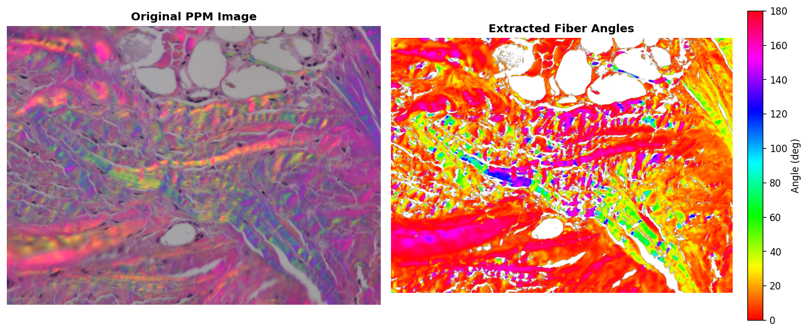
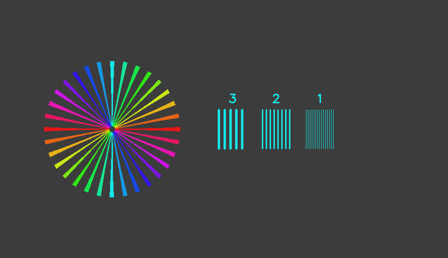
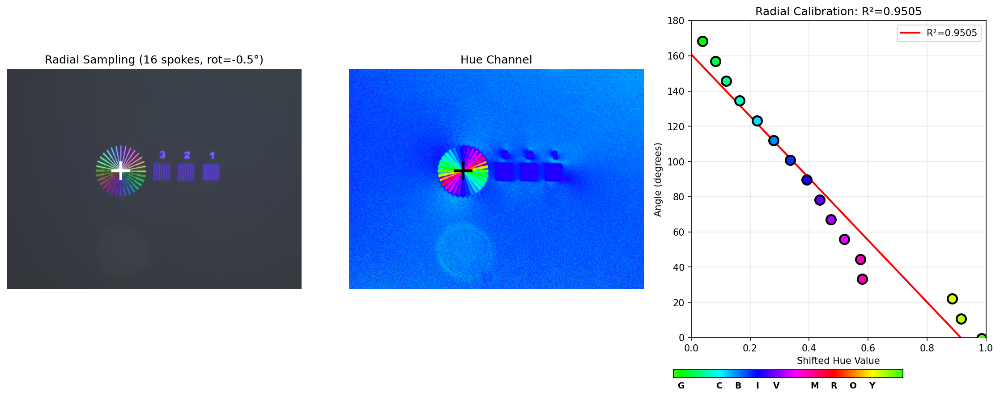
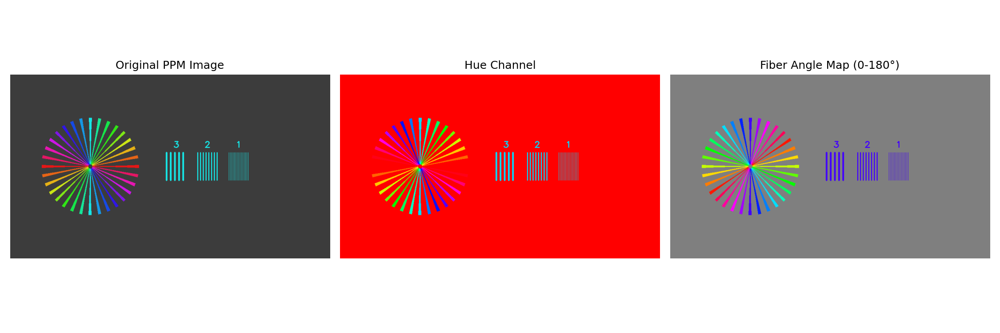

# PPM Library

PPM-specific analysis and acquisition support for polarized light microscopy.

> **Part of the [QPSC (QuPath Scope Control)](https://github.com/uw-loci/qupath-extension-qpsc) system.**
> For complete installation and setup instructions, see the [QPSC Installation Guide](https://github.com/uw-loci/qupath-extension-qpsc/blob/main/documentation/INSTALLATION.md).
>
> **Note:** General microscopy utilities (debayering, background correction, OME-TIFF I/O, Z-stack
> projections) have been moved to [`microscope_imageprocessing`](https://github.com/uw-loci/microscope_imageprocessing),
> which this library depends on. This package focuses on **PPM-specific** analysis and calibration.



*PPM workflow: Original PPM tissue image (left) showing fiber birefringence colors, and extracted fiber orientation angles (right) - rainbow colormap indicates fiber direction (0-180 degrees)*

**[See the Complete Walkthrough with Examples](docs/WALKTHROUGH.md)**

## Features

### PPM Acquisition Support
- **Hardware Polarizer Calibration**: Find crossed polarizer positions
- **PPM Rotation Testing**: Sensitivity testing and birefringence analysis
- **White Balance Coefficients**: PPM-specific WB calibration

### PPM Image Analysis
- **Hue-to-Angle Calibration**: Extract fiber angles from PPM images using sunburst calibration slides
- **PPM Image Loading**: Load and analyze PPM images with HSV extraction
- **Fiber Angle Extraction**: Convert hue values to fiber orientation angles (0-180 degrees)
- **White Balance Correction**: Hue shifting and preprocessing
- **Complete Analysis Workflows**: End-to-end PPM analysis with masking and statistics

### General Utilities (via microscope_imageprocessing)

The following utilities are provided by the [`microscope_imageprocessing`](https://github.com/uw-loci/microscope_imageprocessing) dependency and re-exported for convenience:
- **Debayering**: CPU-based Bayer pattern demosaicing (`CPUDebayer`)
- **Background Correction**: Flat-field correction (`BackgroundCorrectionUtils`)
- **OME-TIFF I/O**: Standards-compliant TIFF writing with metadata (`ome_tiff_writer`)

## Installation

**Requirements:**
- Python 3.10 or later
- pip (Python package installer)
- Git (for `pip install git+https://...` commands)

**Dependencies:** This package depends on [`microscope_imageprocessing`](https://github.com/uw-loci/microscope_imageprocessing)
for general imaging utilities. Install it first.

### Quick Install (from GitHub)

```bash
# 1. Install microscope-imageprocessing (required dependency)
pip install git+https://github.com/uw-loci/microscope_imageprocessing.git

# 2. Install ppm-library
pip install git+https://github.com/uw-loci/ppm_library.git
```

### Development Install (editable mode)

```bash
git clone https://github.com/uw-loci/ppm_library.git
cd ppm_library
pip install -e ".[dev]"
```

## Quick Start

### General Imaging (from microscope_imageprocessing)

```python
from microscope_imageprocessing import BackgroundCorrectionUtils, CPUDebayer

# Background correction
corrector = BackgroundCorrectionUtils()
corrected = corrector.apply_flatfield(raw_image, background_image)

# Debayering
debayer = CPUDebayer(pattern='RGGB')
rgb_image = debayer.debayer(bayer_image)
```

### PPM Analysis - Fiber Angle Extraction

```python
from ppm_library import RadialCalibrator, PPMImage

# Step 1: Create calibration from sunburst slide
calibrator = RadialCalibrator(n_spokes=16)
calibration = calibrator.calibrate("sunburst_slide.tif", debug_plot=True)

# Save calibration for later use
calibration.save("my_calibration.npz")

# Step 2: Load PPM sample image
ppm_image = PPMImage.load("sample.tif")

# Step 3: Convert to fiber angles
angle_map = ppm_image.to_angle_map(calibration)

# Step 4: Analyze results
from ppm_library import analyze_ppm

result = analyze_ppm(
    calibration_input="my_calibration.npz",
    ppm_image_path="sample.tif",
    mask_image_path="tissue_mask.tif",
    threshold=128  # Analyze bright regions of mask
)

result.print_summary()
# PPM Analysis Results
# ========================================
# Valid pixels analyzed: 125,432
# Mean fiber angle: 45.23 degrees
# Std deviation: 12.87 degrees
# Calibration R-squared: 0.9876
```

### Hue Correction (White Balance)

```python
from ppm_library import hue_shift, compute_hue_shift_from_reference

# Correct white balance by shifting hue
corrected = hue_shift(image, angle_degrees=15.0)

# Or compute shift automatically from a known reference
shift, measured_hue = compute_hue_shift_from_reference(
    image,
    reference_angle=45.0,  # Known fiber angle in ROI
    roi_mask=reference_roi
)
corrected = hue_shift(image, shift)
```

## Module Reference

### `ppm_library.ppm` - Hardware/Acquisition Support
- `PolarizerCalibrationUtils` - Find crossed polarizer positions
- `PPMRotationSensitivityTester` - Test PPM rotation precision
- `PPMBirefringenceMaximizationTester` - Optimize birefringence signal

### `ppm_library.calibration` - Hue-to-Angle Calibration
- `RadialCalibrator` - Radial sampling for sunburst/fan pattern slides
- `RadialCalibrationResult` - Calibration data with hue_to_angle() method
- `HistogramCalibration` - Correct optical anisotropy in hue histograms
- `compute_hue_histogram()` - Compute hue histogram from RGB image

### `ppm_library.imaging` - PPM Image Processing
- `PPMImage` - Container for PPM image data with HSV extraction
- `AngleMap` - Fiber angle extraction results with analysis methods
- `load_ppm_image()` - Convenience function to load PPM images
- `hue_shift()` - White balance correction by shifting hue
- `compute_hue_shift_from_reference()` - Auto white balance from reference
- `preprocess_ppm_image()` - Standard Gaussian + median preprocessing

### `ppm_library.analysis` - Complete Workflows
- `analyze_ppm()` - Complete workflow for PPM image analysis
- `PPMAnalysisResult` - Analysis results with statistics and visualization

### `ppm_library.surface_analysis` - Perpendicularity and Orientation Analysis
- `analyze_perpendicularity()` - Analyze fiber perpendicularity with orientation fields and masks
- `save_pixel_arrays()` - Persist per-pixel fields (deviation angles, fiber angles, masks, etc.) to `.npy` files
- `render_orientation_overlay()` - Render a blue-to-red RGBA PNG showing relative fiber orientation
- `compute_window_alignment()` - Aggregate per-pixel fiber orientations into a square-window grid using axial circular statistics (mean angle and order parameter)
- `render_window_alignment_overlay()` - Viridis heatmap of per-window order parameter (fiber alignment); transparent where no data
- `render_window_orientation_overlay()` - HSV-based heatmap of per-window dominant orientation, saturation gated by order parameter
- `save_window_metrics()` - Export per-window metrics to both `.npz` (full arrays) and `windows.json` (per-window records for non-numpy languages)

### From `microscope_imageprocessing` (dependency, re-exported)
- `CPUDebayer` - Bayer pattern demosaicing
- `BackgroundCorrectionUtils` - Flat-field correction
- `ome_tiff_writer` - OME-TIFF writing with metadata

## Testing

### Automated Unit Tests

```bash
# Install dev dependencies
pip install -e ".[dev]"

# Run all tests
pytest

# Run specific test file
pytest tests/test_debayering.py
pytest tests/test_debayering.py

# Run with coverage report
pytest --cov=ppm_library --cov-report=html
```

### Command-Line Tools

- `ppm-recompute-biref` - Regenerate birefringence images using the current per-channel method. Walks a folder recursively, finds birefringence images, locates their source positive/negative angle images, and rewrites the birefringence using the current algorithm. Output is a pyramidal OME-TIFF matching the production stitched biref (uint16, 512-px tiles, LZW, factor-2 levels); handles arbitrarily large slides via streaming + memory-mapping. Usage: `ppm-recompute-biref FOLDER [--suffix _colorrms] [--overwrite] [--dry-run] [--tile 512] [--compression lzw] [--mem-budget-gb N]`. **Setup + operator guide (new-computer install, file-naming, RAM tuning): [`docs/RECOMPUTE_BIREF_GUIDE.md`](docs/RECOMPUTE_BIREF_GUIDE.md).**
- `ppm-analyze` - Command-line interface for PPM analysis (see `ppm_library.analysis.cli`).

### Hardware Diagnostic Tools

PPM-specific diagnostic tools for hardware characterization:
- `ppm/birefringence_test.py` - PPM birefringence maximization testing
- `ppm/sensitivity_test.py` - PPM rotation sensitivity testing

These are called from the QuPath QPSC extension GUI during microscope setup.

## Visual Workflow

### 1. Calibration Slide

Use a sunburst calibration slide with spokes at known orientations (synthetic phantom shown):



### 2. Create Calibration Model

The calibrator fits a linear regression between hue and angle:



### 3. Extract Fiber Angles

Apply calibration to PPM images to get fiber orientation angles:



**For detailed instructions, see the [Complete Walkthrough](docs/WALKTHROUGH.md).**

## Examples

See the `examples/` directory for complete examples:
- `create_phantom.py` - Create synthetic calibration phantoms for testing

## License

MIT License - see [LICENSE](LICENSE) for details.

## Authors

- Mike Nelson (msnelson8@wisc.edu)
- Bin Li (bli346@wisc.edu)
- Jenu Chacko (jenu.chacko@wisc.edu)

## AI-Assisted Development

This project was developed with assistance from [Claude](https://claude.ai) (Anthropic). Claude was used as a development tool for code generation, architecture design, debugging, and documentation throughout the project.
