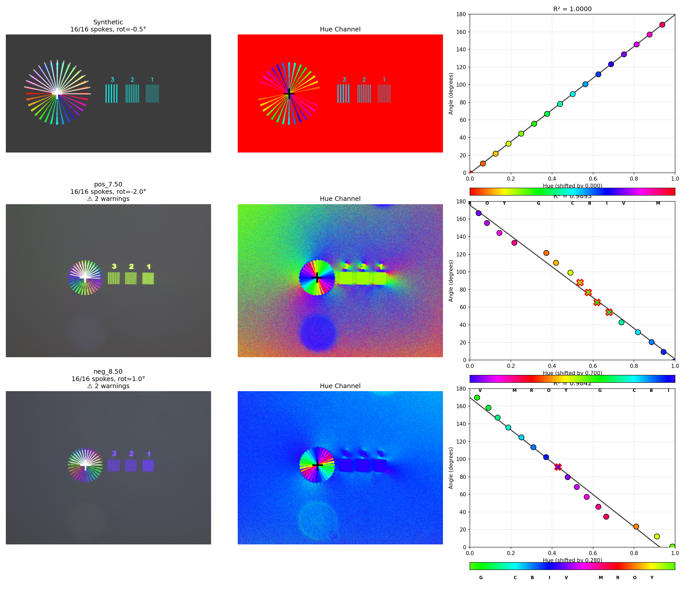
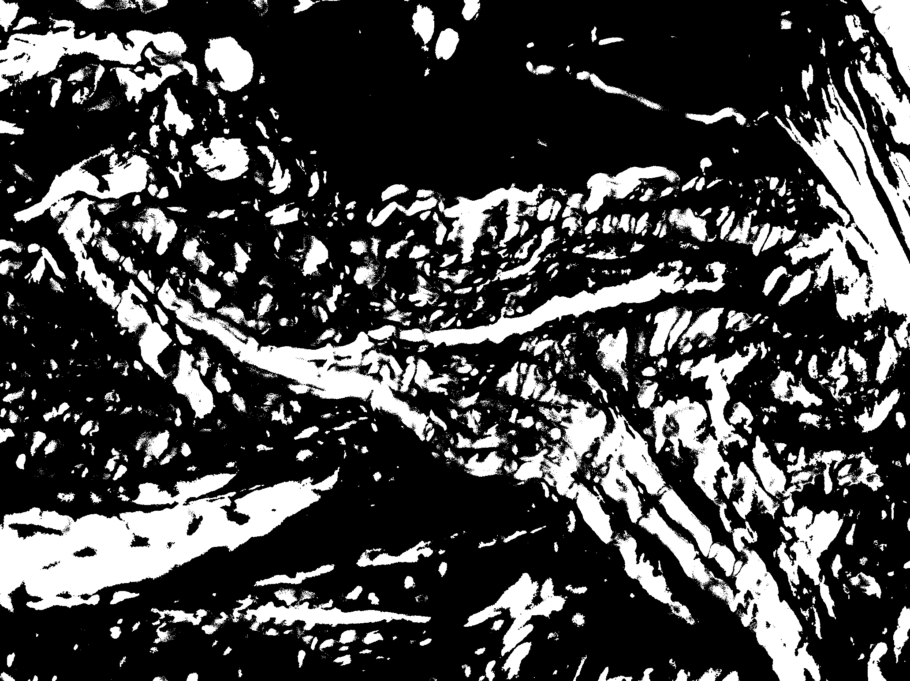
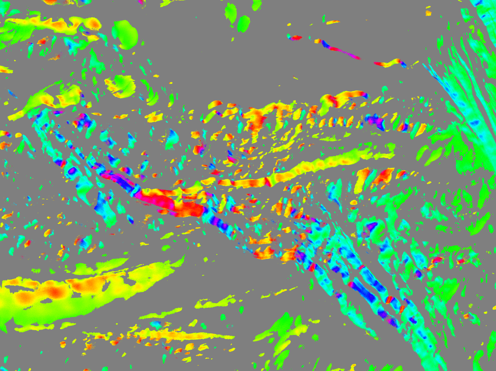

# PPM Library Walkthrough

This guide walks you through the complete workflow for analyzing Polychromatic Polarization Microscopy (PPM) images using ppm_library.

## Table of Contents

1. [Overview](#overview)
2. [Installation](#installation)
3. [Step 1: Calibration](#step-1-calibration)
4. [Step 2: Loading PPM Images](#step-2-loading-ppm-images)
5. [Step 3: Extracting Fiber Angles](#step-3-extracting-fiber-angles)
6. [Step 4: Complete Analysis Workflow](#step-4-complete-analysis-workflow)
7. [Additional Features](#additional-features)

---

## Overview

PPM (Polychromatic Polarization Microscopy) produces images where fiber orientation is encoded as color (hue). The ppm_library provides tools to:

1. **Calibrate** the hue-to-angle relationship using a sunburst calibration slide
2. **Load** PPM images and extract HSV color information
3. **Convert** hue values to fiber orientation angles (0-180 degrees)
4. **Analyze** fiber orientation distributions with masking and statistics

### The PPM Workflow

```
Calibration Slide --> Calibration Model --> Apply to Sample --> Fiber Angles
     (sunburst)      (hue -> angle)         (PPM image)        (0-180 deg)
```

---

## Installation

```bash
pip install git+https://github.com/uw-loci/ppm_library.git
```

Or for development:
```bash
git clone https://github.com/uw-loci/ppm_library.git
cd ppm_library
pip install -e ".[dev]"
```

---

## Step 1: Calibration

Before analyzing PPM images, you need to create a calibration model that maps hue values to fiber angles. This is done using a **sunburst calibration slide** - a special slide with spokes at known orientations.

### What is a Calibration Slide?

A calibration slide contains a sunburst pattern where each spoke has a known fiber orientation angle. When imaged under PPM, each spoke appears as a different color (hue) based on its orientation.


*Synthetic calibration phantom (generated with `create_phantom.py`) - real calibration slides have similar sunburst patterns with spokes at known orientations*

### Creating a Calibration

```python
from ppm_library import RadialCalibrator

# Create calibrator (16 spokes is standard)
calibrator = RadialCalibrator(n_spokes=16)

# Run calibration on your sunburst slide image
calibration = calibrator.calibrate(
    "path/to/sunburst_slide.tif",
    debug_plot=True  # Shows diagnostic visualization
)

# Check calibration quality
print(f"R-squared: {calibration.r_squared:.4f}")
# Good calibrations have R-squared > 0.95

# Save calibration for later use
calibration.save("my_calibration.npz")
```

### Understanding Calibration Output

The calibration process:
1. Detects the center of the sunburst pattern
2. Samples hue values along radial lines at each spoke
3. Fits a linear regression between hue and angle
4. Handles circular hue wrapping automatically



*Calibration visualization showing: (left) detected sampling lines, (middle) hue channel, (right) hue vs angle regression*

### Calibration Quality Indicators

| R-squared | Quality | Notes |
|-----------|---------|-------|
| > 0.98 | Excellent | Ideal for quantitative analysis |
| 0.95 - 0.98 | Good | Suitable for most applications |
| 0.90 - 0.95 | Fair | May have some systematic error |
| < 0.90 | Poor | Check slide quality or parameters |

### Calibration Warnings

The calibrator reports warnings for common issues:
- **SATURATION**: Pixels are overexposed (reduce exposure)
- **LOW_SAMPLES**: Spoke is faded or missing
- **HIGH_VARIANCE**: Measurement is noisy

```python
# Check for warnings
if calibration.warnings:
    for warning in calibration.warnings:
        print(f"Warning: {warning}")
```

---

## Step 2: Loading PPM Images

Once you have a calibration, you can load PPM sample images for analysis.

```python
from ppm_library import PPMImage, load_ppm_image

# Method 1: Using PPMImage class
ppm_image = PPMImage.load(
    "path/to/sample.tif",
    saturation_threshold=0.2,  # Minimum saturation for valid pixels
    value_threshold=0.2        # Minimum brightness for valid pixels
)

# Method 2: Using convenience function
ppm_image = load_ppm_image("path/to/sample.tif")

# Access image properties
print(f"Image shape: {ppm_image.shape}")
print(f"Valid pixels: {ppm_image.valid_mask.sum()}")

# Access HSV channels
hue = ppm_image.hue           # 0-1 range
saturation = ppm_image.saturation
value = ppm_image.value
```

### Understanding Valid Pixels

PPM analysis only works on pixels with sufficient color saturation. Background pixels (gray/white/black) have low saturation and are automatically excluded.

```python
# The valid_mask indicates which pixels can be analyzed
valid_mask = ppm_image.valid_mask

# You can adjust thresholds when loading
ppm_image = PPMImage.load(
    "sample.tif",
    saturation_threshold=0.15,  # Lower = include more pixels
    value_threshold=0.1
)
```

---

## Step 3: Extracting Fiber Angles

Apply the calibration to convert hue values to fiber orientation angles.

```python
from ppm_library import RadialCalibrationResult

# Load saved calibration
calibration = RadialCalibrationResult.load("my_calibration.npz")

# Convert to angle map
angle_map = ppm_image.to_angle_map(calibration)

# Access results
angles = angle_map.angles          # 0-180 degrees, NaN where invalid
valid = angle_map.valid_mask       # Boolean mask of valid measurements
```

### Working with Angle Maps

```python
# Get statistics for the whole image
valid_angles = angles[valid]
print(f"Mean angle: {np.mean(valid_angles):.1f} degrees")
print(f"Std deviation: {np.std(valid_angles):.1f} degrees")

# Get statistics for a region of interest
roi_mask = ...  # Your binary mask
roi_angles = angle_map.get_angles_in_roi(roi_mask)
mean_angle = angle_map.get_mean_angle_in_roi(roi_mask)

# Get angle histogram
counts, bin_edges = angle_map.get_angle_histogram(bins=18)  # 10-degree bins
```

### Visualizing Angle Maps

```python
# Convert to RGB colormap visualization
rgb_visualization = angle_map.to_rgb_colormap(colormap='hsv')

# Save or display
import matplotlib.pyplot as plt
plt.imshow(rgb_visualization)
plt.title("Fiber Orientation Angles")
plt.colorbar(label="Angle (degrees)")
plt.savefig("angle_map.png")
```


*Example showing: (left) original PPM tissue image with fiber birefringence colors, (right) extracted fiber angles with rainbow colormap (0-180 degrees)*

---

## Step 4: Complete Analysis Workflow

For convenience, ppm_library provides a single function that performs the complete analysis workflow.

```python
from ppm_library import analyze_ppm

# Complete analysis in one call
result = analyze_ppm(
    calibration_input="calibration.npz",  # Or path to calibration image
    ppm_image_path="sample.tif",
    mask_image_path="tissue_mask.tif",    # Grayscale mask image
    threshold=128,                         # Pixels > threshold are analyzed
    histogram_bins=18,                     # 10-degree bins
)

# Print summary
result.print_summary()
```

Output:
```
PPM Analysis Results
========================================
Valid pixels analyzed: 125,432
Mean fiber angle: 45.23 degrees
Std deviation: 12.87 degrees
Calibration R-squared: 0.9876
Histogram bins: 18
```

### Using Masks

The mask image defines which regions to analyze. This is typically a tissue segmentation mask.



*Example grayscale mask - bright regions (above threshold) are included in analysis*

```python
# The threshold parameter controls what's included
# Pixels where mask > threshold are analyzed
result = analyze_ppm(
    ...,
    mask_image_path="mask.tif",
    threshold=128,  # Include pixels where mask > 128
)
```

### Accessing Results

```python
# Access all result components
angle_map = result.angle_map           # Full angle map
mask = result.mask                     # Final binary mask used
calibration = result.calibration       # Calibration data

# Statistics
mean = result.mean_angle               # Mean angle in degrees
std = result.std_angle                 # Standard deviation
n_pixels = result.n_valid_pixels       # Number of analyzed pixels

# Histogram
counts = result.histogram_counts       # Bin counts
edges = result.histogram_bin_edges     # Bin edges in degrees

# Visualization
rgb_image = result.angle_rgb           # RGB colormap (uint8)

# Save results
result.save("analysis_results.npz")
```

### Final Visualization



*Final angle map visualization with rainbow colormap showing fiber orientations*

---

## Additional Features

### White Balance Correction

If images have different lighting conditions, use hue correction:

```python
from ppm_library import hue_shift, compute_hue_shift_from_reference

# Manual correction - shift all hue values
corrected = hue_shift(image, angle_degrees=15.0)

# Automatic correction from a known reference
shift, measured_hue = compute_hue_shift_from_reference(
    image,
    reference_angle=45.0,  # Known fiber angle at ROI
    roi_mask=reference_roi
)
corrected = hue_shift(image, shift)
```

### Image Preprocessing

Apply standard preprocessing (Gaussian smoothing + median filter):

```python
from ppm_library import preprocess_ppm_image

# Apply preprocessing (matches MATLAB PIKL workflow)
preprocessed = preprocess_ppm_image(
    image,
    gaussian_sigma=2.0,
    median_size=5
)
```

### Histogram Anisotropy Correction

Correct for optical anisotropy in the PPM system:

```python
from ppm_library import HistogramCalibration, compute_hue_histogram

# Create correction from circular calibration pattern
histogram = compute_hue_histogram(circular_pattern_image)
correction = HistogramCalibration.from_circular_histogram(histogram)

# Apply correction to measured histograms
corrected_histogram = correction.correct_histogram(raw_histogram)
```

### Per-Window Fiber Alignment Analysis

Aggregate pixel-level fiber angles into a spatial grid to visualize fiber alignment at larger scales. Useful for detecting regions of high alignment vs. isotropic fiber distributions:

```python
from ppm_library.surface_analysis import (
    compute_window_alignment,
    render_window_alignment_overlay,
    render_window_orientation_overlay,
    save_window_metrics
)

# Compute per-window alignment metrics
window_metrics = compute_window_alignment(
    fiber_angles=angles,           # From angle_map.angles
    fiber_mask=angle_map.valid_mask,
    window_px=32,                  # 32x32 pixel windows
    stride_px=16,                  # 50% overlap
    min_pixels=10                  # Minimum valid pixels per window
)

# Render order parameter as viridis heatmap (0=isotropic, 1=perfectly aligned)
render_window_alignment_overlay(
    window_metrics,
    output_path="alignment_heatmap.png",
    region_h=angles.shape[0],
    region_w=angles.shape[1]
)

# Render dominant orientation as HSV heatmap (hue=angle, saturation=alignment strength)
render_window_orientation_overlay(
    window_metrics,
    output_path="orientation_heatmap.png",
    region_h=angles.shape[0],
    region_w=angles.shape[1]
)

# Save metrics for downstream analysis (e.g., emit as PathObjects in QuPath)
save_window_metrics(window_metrics, output_dir="window_analysis/")
```

The results include:
- **window_metrics.npz** - Full numpy arrays (mean angles, order parameters, pixel counts, centers)
- **windows.json** - Per-window records for languages without numpy (includes only non-empty windows)

---

## Example Scripts

See the `examples/` directory for complete working examples:

- **`create_phantom.py`** - Create synthetic calibration phantoms for testing

Run the examples:
```bash
# Create a test phantom
python examples/create_phantom.py
```

---

## Troubleshooting

### Low R-squared in Calibration

- Check image exposure (avoid saturation)
- Ensure sunburst pattern is in focus
- Try adjusting `saturation_threshold` and `value_threshold`
- Check for dust or artifacts on the calibration slide

### No Valid Pixels in Analysis

- Lower the `saturation_threshold` when loading images
- Check that the mask covers tissue regions
- Ensure the PPM image has sufficient color saturation

### Unexpected Angle Values

- Verify calibration was done with the same optical setup
- Check for white balance differences between calibration and sample
- Use `hue_shift` to correct for lighting differences

---

## API Reference

For complete API documentation, see the module docstrings:

```python
from ppm_library import RadialCalibrator
help(RadialCalibrator)

from ppm_library import analyze_ppm
help(analyze_ppm)
```
